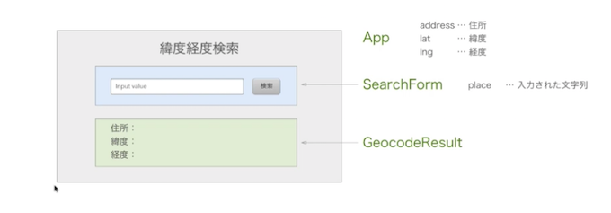

# 緯度経度検索サービス
今回作成するコンポーネントはAppコンポーネントとSearchFormと結果表示領域(GeocodeResult)になります。
stateは入力内容をplaceとしてSearchFormに持たせて、その結果のaddress,lat,lngはAppのステートとします。



## app.jsxファイルの準備
App.jsxファイルの準備をします。必要事項だけ記入して出力したい中身はまだ白紙の状態です。

```
import React, { Component } from 'react';

class App extends Component {
  constructor(props) {
    super(props);
    this.state = {

    };
  }

  render() {
    return (
      <div>
      </div>
    );
  }
}

export default App;

```

## search formの作成
まずはSearchFormから作成します。
ファイルSearchForm.jsxファイルを作成して次の記述を行います。

```
import React, { Component, PropTypes } from 'react';

class SearchForm extends Component {
  constructor(props) {
    super(props);
    this.state = {
      place: '東京駅', //空でも良い
    };
  }

  handlePlaceChange(place) {
    this.setState({ place });
  }

  handleSubmit(e) {
    e.preventDefault();
    this.props.onSubmit(this.state.place);
  }

  render() {
    return (
      <form onSubmit = {e => this.handleSubmit(e)}>
        <input
          type="text"
          value={this.state.place}
          onChange={e => this.handlePlaceChange(e.target.value)}
        />
        <input type="submit" value="検索" />
      </form>
    );
  }
}

SearchForm.proTypes = {
  onSubmit: PropTypes.func.isRequired,
};

export default SearchForm;

```

## searchフォームをブラウザで表示
SearchFormをブラウザで見れるようにするにはApp.jsに追加の記述を行います。

App.jsxファイルの記述
```
import React, { Component } from 'react';

import SearchForm from './SearchForm';

class App extends Component {
  constructor(props) {
    super(props);
    this.state = {

    };
  }

  handlePlaceSubmit(place){
    console.log(place);
  }

  render() {
    return (
      <div>
        <h1>緯度経度検索</h1>
        <SearchForm onSubmit={place => this.handlePlaceSubmit(place)} />
      </div>
    );
  }
}

export default App;

```

ブラウザ（localhost:8080）で確認すると入力ボックスに「東京駅」と表示されています。submitボタンをクリックすると
コンソール画面で確認すると入力内容が確認されます。

## GeocodeResult部分作成

App.jsx
```
import React, { Component } from 'react';

import SearchForm from './SearchForm';
import GeocodeResult from './GeocodeResult';

class App extends Component {
  constructor(props) {
    super(props);
    this.state = {

    };
  }

  handlePlaceSubmit(place){

  }

  render() {
    return (
      <div>
        <h1>緯度経度検索</h1>
        <SearchForm onSubmit={place => this.handlePlaceSubmit(place)} />
        <GeocodeResult address={this.state.address} lat={this.state.lat} lng={this.state.lng} />
      </div>
    );
  }
}

export default App;

```

GeocodeResult.jsx
```
import React, { PropTypes } from 'react';

const GeocodeResult = ({ address, lat, lng }) => (
  <ul className="geocode-result">
    <li>住所:{address}</li>
    <li>緯度:{lat}</li>
    <li>経度:{lng}</li>
  </ul>
);

GeocodeResult.PropTypes = {
  address: PropTypes.string,
  lat: PropTypes.number,
  lng: PropTypes.number,
};

GeocodeResult.defaultProps = {
  address: '',
  lat: 0,
  lng: 0,
};

export default GeocodeResult;

```

index.scss
```
$background-color: #eee;
$text-color:#444;
body{
  background-color: $background-color;
  text-align: center;
  color:$text-color;
}
.geocode-result{
  width:400px;
  margin: 0 auto;
  text-align:left;
}
```